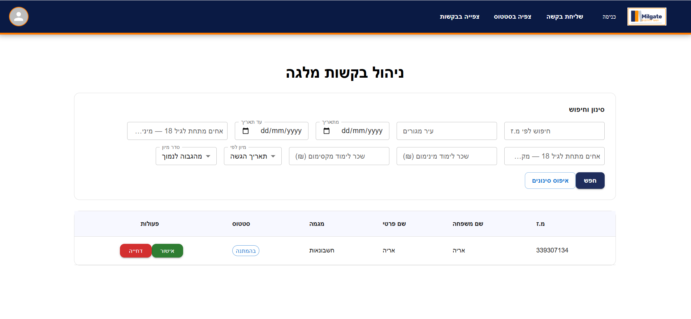
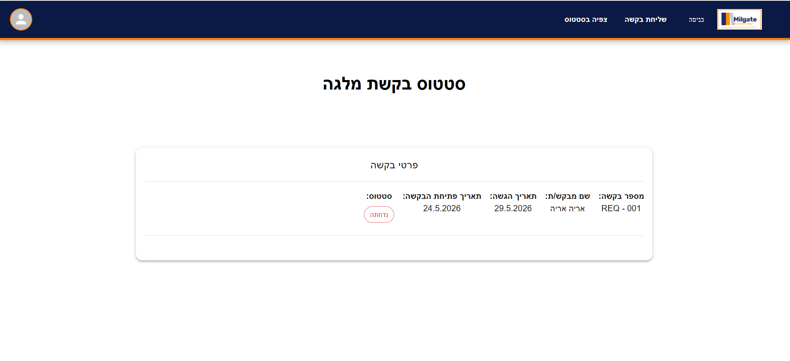

<div align="center">

# 🎓 Student Grant Management System

### A full-stack platform for managing student financial-aid requests, end-to-end

[](https://react.dev/)
[](https://nodejs.org/)
[](https://expressjs.com/)
[](https://www.mongodb.com/)
[](#license)
[]()

<br/>



<br/>

**[⭐ Star this repo](https://github.com/Chana-Winefeld/student-grant-management-system) · [🐛 Report a Bug](https://github.com/Chana-Winefeld/student-grant-management-system/issues) · [💡 Request a Feature](https://github.com/Chana-Winefeld/student-grant-management-system/issues)**

</div>

---

## 📋 Table of Contents

- [About the Project](#-about-the-project)
- [Key Features](#-key-features)
- [Tech Stack](#-tech-stack)
- [Architecture](#-architecture)
- [Screenshots](#-screenshots)
- [Getting Started](#-getting-started)
  - [Prerequisites](#prerequisites)
  - [Installation](#installation)
  - [Environment Variables](#environment-variables)
  - [Running the App](#running-the-app)
- [Project Structure](#-project-structure)
- [The Multi-Step Application Form](#-the-multi-step-application-form)
- [User Roles](#-user-roles)
- [API Overview](#-api-overview)
- [Roadmap](#-roadmap)
- [Contributing](#-contributing)
- [License](#-license)
- [Contact](#-contact)

---

## 📖 About the Project

**Student Grant Management System** is a full-stack web application built with **React** and **Node.js** that digitizes the process of applying for and managing student financial grants.

Students can register, log in, and submit a detailed, multi-step grant application — including personal, family, academic, and banking information, along with required supporting documents. Administrators get a dedicated dashboard to review, filter, sort, and approve or reject submitted requests.

The goal of the project is to replace a manual, paper-based grant request process with a clean, validated, and fully traceable digital workflow.

---

## ✨ Key Features

### 🔐 Authentication
- Secure registration and login using **National ID + password**
- Automatic redirect to the home page for authenticated users, and to registration for guests
- *(Bonus)* JWT token stored in cookies for persistent, automatic login
- *(Bonus)* Logout clears all session data, including cookies

### 🧑‍🎓 Student Experience
- **Multi-step grant application form**, pre-filled with existing user data where available
- Real-time **field validation** and required-field enforcement
- **Draft auto-save** *(bonus)* — resume an unfinished application exactly where you left off
- Upload required documents (ID, parental ID copies, enrollment confirmation, bank confirmation)
- **Live status tracking** of the most recently submitted request
- *(Bonus)* Email notifications when a request is received and when its status changes, with a direct link to view the result

### 🛠️ Admin Dashboard
- Table view of all **pending** requests with key applicant details
- **Server-side filtering & sorting** by:
  - National ID
  - Date range (from / to / exact)
  - Number of siblings under 18 (above / below / sort)
  - City of residence
  - Annual income (above / below / sort)
- Drill into full **request details**, including individual document previews
- One-click **approve** or **reject** actions

### 🚀 Bonus / Stretch Features
- Live document preview before approval
- Postal code field with a direct link to address lookup
- Google Maps autocomplete for address & city fields
- Fully responsive, accessible multi-step form UI

---

## 🧰 Tech Stack

| Layer | Technology |
|---|---|
| **Frontend** | React, React Router, Context API / Redux *(adjust to what you used)* |
| **Backend** | Node.js, Express.js |
| **Database** | MongoDB (Mongoose ODM) |
| **Authentication** | JWT, HTTP-only cookies |
| **File Storage** | Server-side storage / GridFS *(adjust to your implementation)* |
| **Styling** | CSS Modules / Tailwind / MUI *(adjust to what you used)* |
| **Tooling** | Vite / Create React App, ESLint, Prettier |

> ✏️ Edit this table to match the exact libraries you used (form library, state manager, styling solution, etc.) — it's one of the first things reviewers check.

---

## 🏗️ Architecture

### Component Hierarchy

```
App
├── Nav (Routing)
│
├── Home
│   ├── Login ─────► Home
│   └── Register ──► Home
│
├── Send Request
│   ├── PersonalForm
│   ├── FamilyForm
│   ├── CourseForm
│   ├── BankForm
│   ├── Verify
│   └── Apply
│
├── View Status
│
└── View Requests (Admin)
    └── Request Details
```

### High-Level Flow

```
┌──────────┐     register/login      ┌──────────┐
│  Guest   │ ───────────────────────►│  Student │
└──────────┘                         └────┬─────┘
                                           │ submit application
                                           ▼
                                   ┌───────────────┐
                                   │  Status: PENDING │
                                   └───────┬───────┘
                                           │
                                           ▼
                                   ┌───────────────┐
                                   │     Admin      │
                                   │ reviews request│
                                   └───────┬───────┘
                                           │
                          ┌────────────────┴────────────────┐
                          ▼                                  ▼
                  ┌───────────────┐                  ┌───────────────┐
                  │   APPROVED    │                  │    REJECTED    │
                  └───────────────┘                  └───────────────┘
```

---

## 🖼️ Screenshots

<div align="center">

### 📋 Request Status — Student View


<br/>

### 🛠️ All Requests — Admin Dashboard


</div>

---

## 🚀 Getting Started

### Prerequisites

Make sure you have the following installed:

- [Node.js](https://nodejs.org/) (v18 or higher)
- [npm](https://www.npmjs.com/) or [yarn](https://yarnpkg.com/)
- A [MongoDB](https://www.mongodb.com/) instance (local or [MongoDB Atlas](https://www.mongodb.com/atlas))

### Installation

```bash
# 1. Clone the repository
git clone https://github.com/Chana-Winefeld/student-grant-management-system.git
cd student-grant-management-system

# 2. Install server dependencies
cd server
npm install

# 3. Install client dependencies
cd ../client
npm install
```

### Environment Variables

Create a `.env` file inside the `server` directory:

```env
PORT=5000
MONGO_URI=mongodb+srv://<username>:<password>@cluster.mongodb.net/student-grant-management
JWT_SECRET=your_jwt_secret_here
CLIENT_URL=http://localhost:3000

# Optional — only if email notifications are implemented
EMAIL_SERVICE=gmail
EMAIL_USER=your_email@example.com
EMAIL_PASS=your_app_password
```

> 🔒 Never commit your real `.env` file. Add it to `.gitignore` and provide a `.env.example` instead.

### Running the App

```bash
# Run the backend (from /server)
npm run dev

# Run the frontend (from /client, in a separate terminal)
npm start
```

The app will be available at `http://localhost:3000`, with the API running at `http://localhost:5000`.

---

## 📁 Project Structure

```
student-grant-management-system/
├── client/                  # React frontend
│   ├── public/
│   └── src/
│       ├── components/
│       │   ├── Nav/
│       │   ├── Login/
│       │   ├── Register/
│       │   ├── SendRequest/
│       │   │   ├── PersonalForm/
│       │   │   ├── FamilyForm/
│       │   │   ├── CourseForm/
│       │   │   ├── BankForm/
│       │   │   ├── Verify/
│       │   │   └── Apply/
│       │   ├── ViewStatus/
│       │   └── Admin/
│       │       ├── ViewRequests/
│       │       └── RequestDetails/
│       ├── context/         # Auth / global state
│       ├── services/        # API calls
│       └── App.js
│
├── server/                  # Node + Express backend
│   ├── controllers/
│   ├── models/
│   │   ├── User.js
│   │   └── Request.js
│   ├── routes/
│   ├── middleware/          # Auth, validation
│   ├── uploads/             # Uploaded documents
│   └── server.js
│
├── .env.example
└── README.md
```

---

## 📝 The Multi-Step Application Form

The grant application is split into clear, validated steps:

| Step | Section | Fields |
|---|---|---|
| 1 | **Personal Details** | National ID, last/first name, birth date, city, address, mobile phone, landline *(optional)* — pre-filled and locked for already-registered data |
| 2 | **Family Details** | Parents' ID & names, number of siblings under 18, number of siblings over 21 with children · per-sibling ID, name, and birth date (dynamic add) |
| 3 | **Academic Details** | Track/major *(predefined list)*, institution name, years of study, annual tuition |
| 4 | **Bank Details** | Account holder ID, bank name & number *(predefined list)*, branch number, account number |
| 5 | **Documents** | ID + appendix for student and each parent, enrollment confirmation, bank account confirmation |
| 6 | **Review & Submit** | Confirmation that all details are accurate → submit or cancel |

On submission, the request status is automatically set to **Pending**, and the submission date is recorded automatically.

---

## 👥 User Roles

| Role | Permissions |
|---|---|
| **Guest** | View the application form (read-only), register, log in |
| **Student** | Submit a request, save drafts, view their own request status |
| **Admin** | View all pending requests, filter & sort, view full request details and documents, approve or reject requests |

---

## 🔌 API Overview

> Adjust endpoints below to match your actual implementation.

| Method | Endpoint | Description | Access |
|---|---|---|---|
| `POST` | `/api/auth/register` | Register a new student | Public |
| `POST` | `/api/auth/login` | Log in and receive a token | Public |
| `POST` | `/api/auth/logout` | Log out and clear session | Student |
| `GET` | `/api/requests/me` | Get the current user's latest request status | Student |
| `POST` | `/api/requests` | Submit a new grant request | Student |
| `PUT` | `/api/requests/draft` | Save/update a draft application | Student |
| `GET` | `/api/requests` | Get all pending requests *(filterable/sortable)* | Admin |
| `GET` | `/api/requests/:id` | Get full request details | Admin |
| `PATCH` | `/api/requests/:id/status` | Approve or reject a request | Admin |

---

## 🗺️ Roadmap

- [x] Registration & login
- [x] Multi-step application form with validation
- [x] Admin dashboard with filter & sort
- [x] Approve / reject flow
- [ ] Draft auto-save
- [ ] JWT in HTTP-only cookies with auto-login
- [ ] Email notifications on status change
- [ ] Google Maps address autocomplete
- [ ] Postal code lookup integration
- [ ] Document preview before approval

See the [open issues](#) for a full list of proposed features and known issues.

---

## 🤝 Contributing

Contributions are what make the open-source community such an amazing place to learn and create. Any contributions you make are **greatly appreciated**.

1. Fork the project
2. Create your feature branch (`git checkout -b feature/AmazingFeature`)
3. Commit your changes (`git commit -m "feat: add AmazingFeature"`)
4. Push to the branch (`git push origin feature/AmazingFeature`)
5. Open a Pull Request

---

## 📄 License

Distributed under the MIT License. See `LICENSE` for more information.

---

## 📬 Contact

**Chana Winefeld** — chani300w@gmail.com

Project Link: [https://github.com/Chana-Winefeld/student-grant-management-system](https://github.com/Chana-Winefeld/student-grant-management-system)

<div align="center">

⭐️ If you found this project useful, consider giving it a star!

</div>